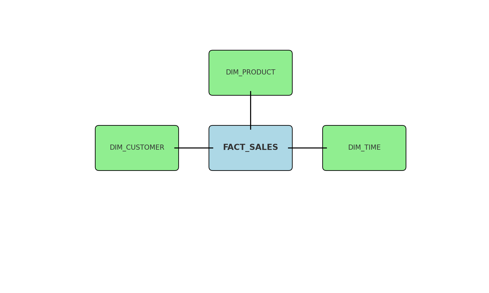

# 🧊 Retail Sales Analytics Warehouse using Snowflake

## 📌 Project Summary
This project demonstrates how to design and implement a mini data warehouse using **Snowflake** to analyze retail sales across products, customers, and time periods. Built as a student portfolio project, it showcases dimensional modeling, SQL querying, and cloud data warehousing best practices.

## 🧠 Objective
Build a data warehouse to answer key business questions such as:
- Which products generate the most revenue?
- What is the monthly trend in sales?
- How do different customer age groups perform in terms of spending?

---

## 🗃️ Schema Design

This project uses a **star schema** with:
- **FACT_SALES** (fact table)
- **DIM_PRODUCT**, **DIM_CUSTOMER**, **DIM_TIME** (dimension tables)



---

## 📂 Data Files
| File Name          | Table Name     | Description                      |
|-------------------|----------------|----------------------------------|
| `dim_product.csv`  | DIM_PRODUCT    | Product details                  |
| `dim_customer.csv` | DIM_CUSTOMER   | Customer info with age/location |
| `dim_time.csv`     | DIM_TIME       | Date breakdowns                 |
| `fact_sales.csv`   | FACT_SALES     | Transaction-level sales data    |

---

## 💻 Technologies Used
- ❄️ **Snowflake** (on Azure, Pune)
- 🐍 Python (for data generation)
- 📄 CSV files (local upload)
- 🧾 SQL (Joins, Group By, Aggregates)

---

## 📊 Key SQL Queries & Insights

### 🔹 Total Sales per Product
```sql
SELECT 
  p.name AS product_name,
  SUM(f.quantity) AS total_units_sold,
  SUM(f.total_amount) AS total_revenue
FROM FACT_SALES f
JOIN DIM_PRODUCT p ON f.product_id = p.product_id
GROUP BY p.name
ORDER BY total_revenue DESC;
```

### 🔹 Monthly Sales Trend
```sql
SELECT 
  t.month,
  SUM(f.total_amount) AS monthly_revenue
FROM FACT_SALES f
JOIN DIM_TIME t ON f.time_id = t.time_id
GROUP BY t.month;
```

### 🔹 Sales by Customer Age Group
```sql
SELECT 
  c.age_group,
  SUM(f.total_amount) AS total_sales
FROM FACT_SALES f
JOIN DIM_CUSTOMER c ON f.customer_id = c.customer_id
GROUP BY c.age_group
ORDER BY total_sales DESC;
```


---

## 📈 Future Improvements
- Add new dimensions like Store or Region
- Automate data ingestion using Snowpipe
- Build dashboards with Power BI or Streamlit

---

## 📁 Folder Structure
```
snowflake-retail-sales-warehouse/
├── data/
│   ├── dim_product.csv
│   ├── dim_customer.csv
│   ├── dim_time.csv
│   └── fact_sales.csv
├── sql/
│   └── analysis_queries.sql
├── screenshots/
│   └── [add your screenshots here]
├── snowflake_star_schema.png
└── README.md
```
